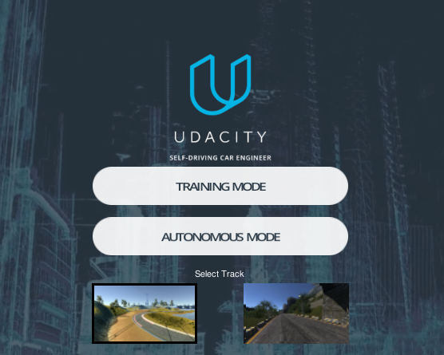
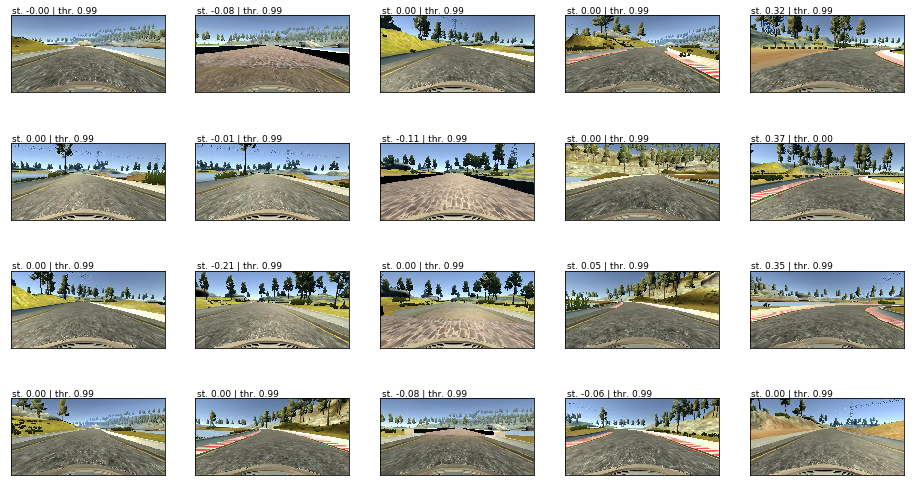
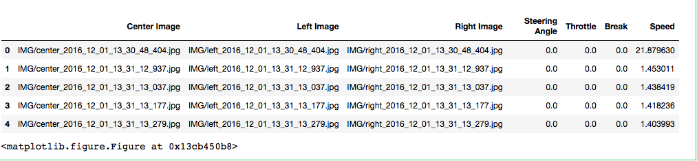
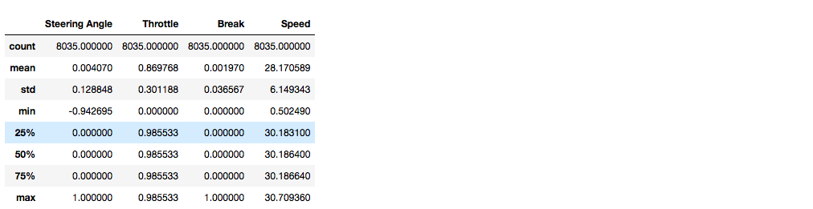
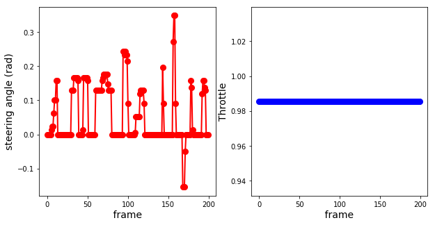
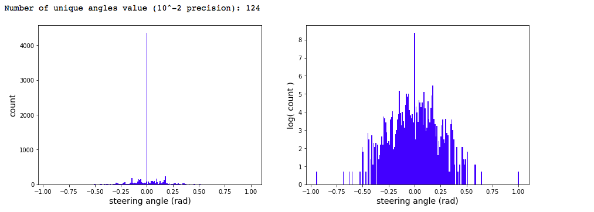
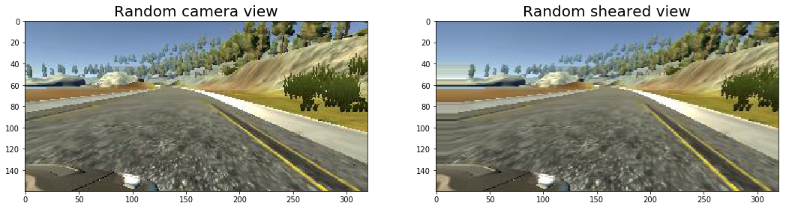
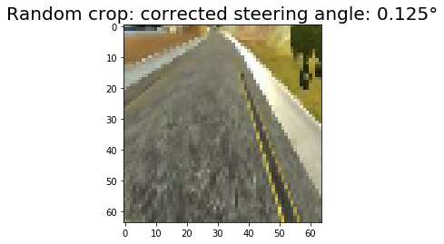
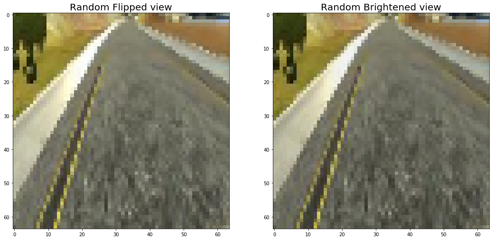
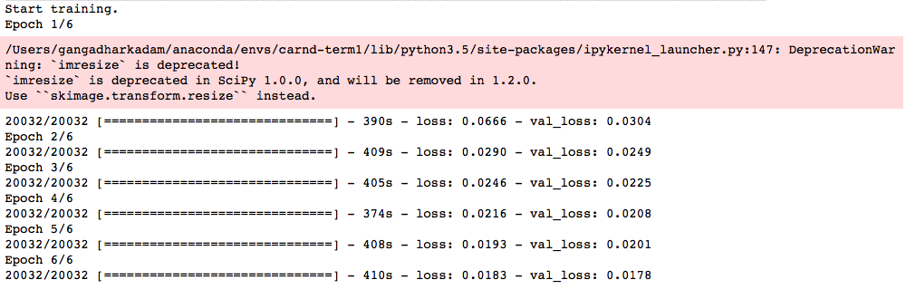

# Self-Driving Car Simulator — Behavioral Cloning (P3)
---



The task is to implement a Deep Neural Network model that predicts the steering angle of a car given images of the road. We are provided with a simulator that can be operated in 2 modes — training and autonomous mode.

In training mode, we drive the car around a track and save the frames (.jpg files) as well as the corresponding steering angle (stored in a .csv file). In fact other parameters values are recorded: throttle, velocity, brake. In autonomous mode, the trained model is used to predict the steering angle and drive the car.

I used the training dataset provided by Udacity, available here. The dataset includes images of the road recorded by 3 cameras mounted on the front of the car, and the csv file with steering angle values for each frame/image.


You can find most of the image effect (image augmentation in `dataset.py` file). The trained model was tested on on track1. Following  animations show the performance of my final model.

Training 
-------


# Goals and Objective
The goals / steps of this project are the following:

- Use the simulator to collect data of good driving behavior
- Build, a convolution neural network in Keras that predicts steering angles from images
- Train and validate the model with a training and validation set
- Test that the model successfully drives around track one without leaving the road
- Summarize the results with a written report

# Dependencies

This project requires **Python 3.5** and the following Python libraries installed:

- [Keras](https://keras.io/)
- [Pandas](http://pandas.pydata.org/)
- [OpenCV](http://opencv.org/)
- [Matplotlib](http://matplotlib.org/) (Optional)
- [Jupyter](http://jupyter.org/) (Optional)
- [NumPy](http://www.numpy.org/)
- [SciPy](https://www.scipy.org/)
- [TensorFlow](http://tensorflow.org)

# Code Structure

My project includes the following files:
* `model.py` containing the script to create, train, test, validate and save the model.
* `drive.py` for driving the car in autonomous mode
* `dataset.py` for image augmentation (resize, crop, shering .. etc)
* `model.h5` containing a trained convolution neural network 
* `model.ipynb` containing data preprocessing, create, train, test, validate and save the model
* this wirteup.md, [this article](https://medium.com/@ksakmann/behavioral-cloning-make-a-car-drive-like-yourself-dc6021152713) and image_transformation_pipeline.ipynb for explanation.

Additionally you need to download and unpack the [Udacity self-driving car simulator](https://github.com/udacity/self-driving-car-sim). 

To run the model start the simulator in `autonomous mode`, open another shell and type 
```
python drive.py model.h5
```

# General considerations

The simulated car is equipped with three cameras, one to the left, one in the center and one to the right of the driver that provide images from these different view points. The training track has sharp corners, exits, entries, bridges, partially missing lane lines and changing light conditions. An additional test track exists with changing elevations, even sharper turns and bumps. It is thus crucial that the CNN does not merely memorize the first track, but generalizes to unseen data in order to perform well on the test track. The model developed here was trained exclusively on the training track and completes the test track.

The main problem lies in the skew and bias of the data set. Shown below is a histogram of the steering angles recorded while driving in the middle of the road for a few laps. This is also the data used for training. The left-right skew is less problematic and can be eliminated by flipping images and steering angles simultaneously. However, even after balancing left and right angles most of the time the steering angle during normal driving is small or zero and thus introduces a bias towards driving straight. The most important events however are those when the car needs to turn sharply. 

Without accounting for this bias towards zero, the car leaves the track quickly. One way to counteract this problem is to  purposely let the car drift  towards the side of the road and to start recovery in the very last moment. 

However, the correct large steering angles are not easy to generate this way, because even then most of the time the car drives straight, with the exception of the short moment when the driver avoids a crash or the car going off the road.

# Data Exploration

### Image visuallization

The dataset is made of a total of 24,108 color images (for left/center/right camera) of size (160 x 320) px


### Data visuallization


As shown above, the data file contains seven columns: URLs for the captured center, left, and right images; the steering angle; the throttle rate; braking; and speed. Each row captures a snapshot of what was happening in the simulator.



The summary statistics above show some interesting information about the data. Steering angle: While the steering angle varied between -1 and 1, it was almost always at 0. The mean is slightly to the right, which suggests additional recovery training was done to learn how to recover from the mostly left turning track. The throttle was almost always fully engaged, only occassionally being released to allow the vehicle to slow down. The break was only applied very lightly while driving. The car was driven almost exclusively at its full speed of 30 mph. It will be interesting to see how successfully the model will be when trained with this high velocity driving and whether it will generalize to slower driving speeds.

# General considerations

The simulated car is equipped with three cameras, one to the left, one in the center and one to the right of the driver that provide images from these different view points. The training track has sharp corners, exits, entries, bridges, partially missing lane lines and changing light conditions. An additional test track exists with changing elevations, even sharper turns and bumps. It is thus crucial that the CNN does not merely memorize the first track, but generalizes to unseen data in order to perform well on the test track. The model developed here was trained exclusively on the training track and completes the test track.

The main problem lies in the skew and bias of the data set. Shown below is a histogram of the steering angles recorded while driving in the middle of the road for a few laps. This is also the data used for training. The left-right skew is less problematic and can be eliminated by flipping images and steering angles simultaneously. However, even after balancing left and right angles most of the time the steering angle during normal driving is small or zero and thus introduces a bias towards driving straight. The most important events however are those when the car needs to turn sharply. 

Without accounting for this bias towards zero, the car leaves the track quickly. One way to counteract this problem is to  purposely let the car drift  towards the side of the road and to start recovery in the very last moment. 

However, the correct large steering angles are not easy to generate this way, because even then most of the time the car drives straight, with the exception of the short moment when the driver avoids a crash or the car going off the road.

Below is a typical profile of the steering angle for successive frames :


Steering angle s=0 have the highest frequency: more than 20 times larger than the frequency of other angle values. Also, there are more positive (1900 counts) than negative angle values (1775 counts).


Similarly to a classification problem, it’s important to check that the dataset is balance — for example, the frequency of negative angles has to be about the same as that of the positive angles. Without balancing the dataset, the model will have the strong bias of mostly predicting zero or negative steering angles. Several data augmentation schemes were built to balance the dataset.

# Data Preprocessing

## Random Shear
We apply random shear operation. However, we select images with 0.9 probability for the random shearing process. 


## Random Crop
To help the system avoid learning other part of the image but only the track, user crops out the sky and car deck parts in the image. Original image size (160x320), after cropping 60px on top and 20px on the bottom, new image size is (80x320).



## Random Flip
- The next stage of the data processing pipeline is called random flip stage. In this stage we randomly (with 0.5 probability) flip images. The idea behind this operation is left turning bends are more prevalent than right bends in the training track.


# Model Architecture

My convolutional neural network (CNN) architecture was inspired by NVIDIA's End to End Learning for Self-Driving Cars paper. The main difference between my model and the NVIDIA mode is that I did use MaxPooling layers just after each  Convolutional Layer in order to cut down training time. 

- 1st layer: normalize input image to -0.5 to 0.5 range.

- For optimizer, Adam optimizer is used. I started with 0.001 training rate but 0.0001 seems to produce a smoother ride. Therefore, I kept 0.0001 learning rate.

```
____________________________________________________________________________________________________
Layer (type)                     Output Shape          Param #     Connected to                     
====================================================================================================
lambda_2 (Lambda)                (None, 64, 64, 3)     0           lambda_input_2[0][0]             
____________________________________________________________________________________________________
convolution2d_6 (Convolution2D)  (None, 32, 32, 24)    1824        lambda_2[0][0]                   
____________________________________________________________________________________________________
activation_10 (Activation)       (None, 32, 32, 24)    0           convolution2d_6[0][0]            
____________________________________________________________________________________________________
maxpooling2d_6 (MaxPooling2D)    (None, 31, 31, 24)    0           activation_10[0][0]              
____________________________________________________________________________________________________
convolution2d_7 (Convolution2D)  (None, 16, 16, 36)    21636       maxpooling2d_6[0][0]             
____________________________________________________________________________________________________
activation_11 (Activation)       (None, 16, 16, 36)    0           convolution2d_7[0][0]            
____________________________________________________________________________________________________
maxpooling2d_7 (MaxPooling2D)    (None, 15, 15, 36)    0           activation_11[0][0]              
____________________________________________________________________________________________________
convolution2d_8 (Convolution2D)  (None, 8, 8, 48)      43248       maxpooling2d_7[0][0]             
____________________________________________________________________________________________________
activation_12 (Activation)       (None, 8, 8, 48)      0           convolution2d_8[0][0]            
____________________________________________________________________________________________________
maxpooling2d_8 (MaxPooling2D)    (None, 7, 7, 48)      0           activation_12[0][0]              
____________________________________________________________________________________________________
convolution2d_9 (Convolution2D)  (None, 7, 7, 64)      27712       maxpooling2d_8[0][0]             
____________________________________________________________________________________________________
activation_13 (Activation)       (None, 7, 7, 64)      0           convolution2d_9[0][0]            
____________________________________________________________________________________________________
maxpooling2d_9 (MaxPooling2D)    (None, 6, 6, 64)      0           activation_13[0][0]              
____________________________________________________________________________________________________
convolution2d_10 (Convolution2D) (None, 6, 6, 64)      36928       maxpooling2d_9[0][0]             
____________________________________________________________________________________________________
activation_14 (Activation)       (None, 6, 6, 64)      0           convolution2d_10[0][0]           
____________________________________________________________________________________________________
maxpooling2d_10 (MaxPooling2D)   (None, 5, 5, 64)      0           activation_14[0][0]              
____________________________________________________________________________________________________
flatten_2 (Flatten)              (None, 1600)          0           maxpooling2d_10[0][0]            
____________________________________________________________________________________________________
dense_6 (Dense)                  (None, 1164)          1863564     flatten_2[0][0]                  
____________________________________________________________________________________________________
activation_15 (Activation)       (None, 1164)          0           dense_6[0][0]                    
____________________________________________________________________________________________________
dense_7 (Dense)                  (None, 100)           116500      activation_15[0][0]              
____________________________________________________________________________________________________
activation_16 (Activation)       (None, 100)           0           dense_7[0][0]                    
____________________________________________________________________________________________________
dense_8 (Dense)                  (None, 50)            5050        activation_16[0][0]              
____________________________________________________________________________________________________
activation_17 (Activation)       (None, 50)            0           dense_8[0][0]                    
____________________________________________________________________________________________________
dense_9 (Dense)                  (None, 10)            510         activation_17[0][0]              
____________________________________________________________________________________________________
activation_18 (Activation)       (None, 10)            0           dense_9[0][0]                    
____________________________________________________________________________________________________
dense_10 (Dense)                 (None, 1)             11          activation_18[0][0]              
====================================================================================================
Total params: 2,116,983
Trainable params: 2,116,983
Non-trainable params: 0
 
```


### Training

Even after cropping and resizing training images (with all augmented images), training dataset was very large and it could not fit into the main memory. Hence, we used `fit_generator` API of the Keras library for training our model.

We created two generators namely:

* `train_batch = Dataset().next_batch()`
* `validation_batch = Dataset().next_batch()` 

Batch size of both `train_batch` and `validation_batch` was 64. We used 20032 images per training epoch. It is to be noted that these images are generated on the fly using the document processing pipeline described above. In addition to that, we used 6400 images (also generated on the fly) for validation. We used `Adam` optimizer with `1e-4` learning rate. Finally, when it comes to the number of training epochs we tried several possibilities such as `5`, `8`, `1`0, `2`5 and `50`. However, `6` works well on both training and validation tracks.




# Results and conclusion

Summarizing, this was a really interesting project. By making consequent use of image augmentation with according steering angle updates we could train a neural network to recover the car from extreme events, like suddenly appearing curves change of lighting conditions by exclusively simulating such events from regular driving data. 

There is much more that can be done. My next step is to tweak the Neural Net so that it is able to predict both the steering angle and the throttle opening.

For more details please check out the code here:
https://github.com/geekay2015/CarND-Behavioral-Cloning-P3

